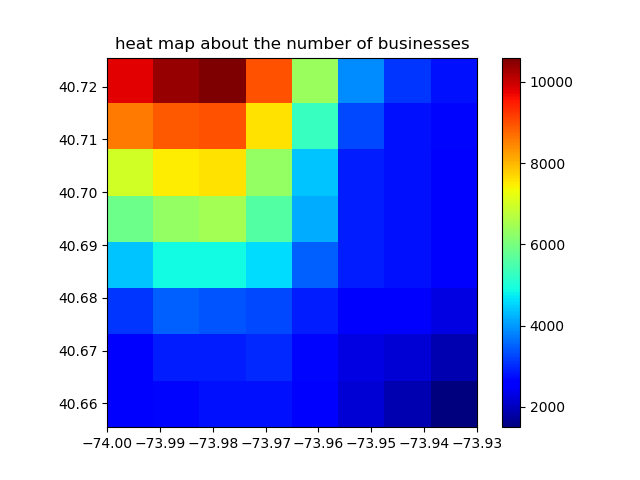

# 商家数量热力图
本文使用yelp的api获取一个经纬度点附近的商家数，绘制热力图，认为商家数越多的点越靠近商业中心，观察商业中心的变化情况。
## 问题
商业中心的变化情况。
## 生成的热力图
[](2019y10m07d.png "2019y10m07d")
8*8热力图
## 思路
### 0.总体流程
#### 0.0.使用当天时间的年月日协助文件命名，便于每日运行。
#### 0.1.设定起始点，之后程序将从起始点开始，从左上到右下，以`stride`为步长，遍历`latitude_num*longitude_num`个点。
> 测试发现选取的点(center)的经纬度点和商家的经纬度点的距离(distance)最大可以达到1km以上，所以步长(stride)定为0.01。
#### 0.2.将`latitude_num*longitude_num`个点的经纬度传递给`get_data(latitude, longitude)`方法，通过api获取数据，存为json文件。
> api的使用详见 https://www.yelp.com/developers/documentation/v3/get_started

> api_key的获取：0.注册yelp账号；1.创建app；2.复制api_key。详见 https://www.yelp.com/developers/documentation/v3/authentication
#### 0.3.使用`data2df()`方法，将json文件整理为dataframe，并将dataframe保存为csv文件。
#### 0.4.使用`data_analysis()`方法，绘制热力图。
```python
def main():
    # ================================ 通过 api 获取数据，保存为 .json 文件 ================================
    if not os.path.exists(data_dir_path):  # 如果不存在文件夹，则创建文件夹
        os.mkdir(data_dir_path)

    for i in range(latitude_num):
        for j in range(longitude_num):
            latitude = '%.5f' % (start_point[0] - i * stride)
            longitude = '%.5f' % (start_point[1] + j * stride)
            get_data(latitude, longitude)
    # ======================================================================================================

    # ================================ 将json文件中的数据读出，处理成df ================================
    data2df()
    # ==================================================================================================

    # ================================ 数据分析 ================================
    data_analysis()
    # ==========================================================================


if __name__ == '__main__':
    today = str(datetime.datetime.now().strftime('%Yy%mm%dd'))  # 用于命名
    data_dir_path = './data_{}'.format(today)
    # start_point = (-74.000000, 40.725500)
    start_point = (40.725500, -74.000000)  # (latitude, longitude)
    stride = 0.01  # latitude-stride  # longitude + stride  # 从左上到右下
    latitude_num = 8
    longitude_num = 8
    df_csv_path = './total_num_df_{}.csv'.format(today)
    main()
```
### 1.获取数据
使用`requests`包，通过yelp的api获取数据，存为json文件
```python
def get_data(latitude, longitude):
    """
    通过 yelp 的 api 获取数据，保存为 .json 文件
    :param latitude:
    :param longitude:
    :return:
    """
    fp = os.path.join(data_dir_path, '{}_{}_{}.json'.format(latitude, longitude, str(int(time.time()))))  # json文件存储路径
    api_key = 'your api key'
    # url = 'https://api.yelp.com/v3/businesses/search?latitude=40.725500&longitude=-74.000000'
    url = 'https://api.yelp.com/v3/businesses/search'
    # url = 'http://httpbin.org/get'
    params = {
        'latitude': latitude,
        'longitude': longitude,
    }
    headers = {
        'Authorization': 'Bearer %s' % api_key,
    }
    r = requests.get(url=url, params=params, headers=headers).text
    # r = requests.get(url=url, params=params, headers=headers).content()
    # r = str(r)
    # r = str(r).replace("'", '"')

    with open(fp, 'w', encoding='utf-8') as f:
        f.write(r)  # 写文件
```
### 2.json --> dataframe
将json文件中的数据读出，处理成df
```python
def data2df():
    """
    将json文件中的数据读出，处理成df
    :return:
    """
    # 初始化保存该点商家数的df
    total_num_df = pd.DataFrame(columns=('c_latitude', 'c_longitude', 'total'))

    f_list = os.listdir(data_dir_path)
    f_list.reverse()
    for _f in f_list:
        _f_list = _f.split('_')
        c_latitude = _f_list[0]
        c_longitude = _f_list[1]
        fp = os.path.join(data_dir_path, _f)
        with open(fp, 'r', encoding='utf-8') as f:
            json_data = json.load(f)
            total = json_data.get('total', 0)
            # businesses = json_data.get('businesses', [])
            # review_count_list = []
            # for _business in businesses:
            #     review_count = _business['review_count']
            #     latitude = _business['coordinates']['latitude']
            #     longitude = _business['coordinates']['longitude']
            #     distance = _business['distance']
            #
            #     review_count_list.append(review_count)
            # print(total, sum(review_count_list), review_count_list)

        temp_dict = {
            'c_latitude': c_latitude,
            'c_longitude': c_longitude,
            'total': total,
        }

        # 存储数据到df
        total_num_df = total_num_df.append([temp_dict], ignore_index=True)

    total_num_df.to_csv(df_csv_path)
```
### 3.绘制热力图
使用dataframe中的数据商家数的绘制热力图
```python
def data_preprocessing(df):
    """
    数据预处理
    :param df:
    :return:
    """

    # df = df.dropna(axis=0, how='any')  # 去除行中包含 NaN 的行

    return df


def data_analysis():
    if os.path.exists(df_csv_path):  # 读出 df
        total_num_df = pd.read_csv(df_csv_path)
    else:
        raise Exception('df csv file not found')

    total_num_df = data_preprocessing(total_num_df)  # 数据预处理

    latitude_s = total_num_df.loc[:, 'c_latitude']
    longitude_s = total_num_df.loc[:, 'c_longitude']
    total_num = np.array(total_num_df.loc[:, 'total']).reshape(latitude_num, longitude_num)

    plt.title('heat map about the number of businesses')
    plt.xlabel('longitude')
    plt.ylabel('latitude')
    plt.imshow(total_num, extent=(np.amin(longitude_s), np.amax(longitude_s), np.amin(latitude_s), np.amax(latitude_s)), cmap='jet')
    plt.colorbar()
    # plt.grid()
    plt.savefig('./{}.png'.format(today))
    plt.show()
```
## 改进
### 0.扩大范围
### 1.使用定时任务每天运行，最后达到类似于气象云图的动态效果，观察商业中心的变化情况。
